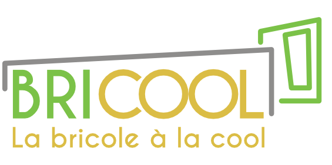

# UltraMotionCorp
Projet fil rouge de la formation POEC Front End IB Formation CEGOS - Groupe 3 - Hélène - Yassine - Kevin et Laurent 

# Description

Le besoin est disponible dans le répertoire doc\spec\Projet_fil_rouge_-_POE_Front.docx

# BRICOOL : LA BRICOLE A LA COOL

# Logiciel requis

## Uniquement Environnement de dev

### Base de donnée

[MongoDB]()

[MongoDB Database Tools](https://www.mongodb.com/try/download/database-tools?tck=docs_databasetools)

## Environnement de test

# Lancer le projet

Ouvrir 